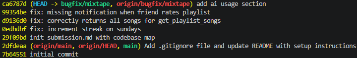

# Mixtape starter

## AI Usage
I used AI tools to inspect the codebase structure, identify the relevant files, and validate the bug fix logic.

- Used code search and file reads to locate `services/notification_service.py`, `services/streak_service.py`, and `services/playlist_service.py`.
- Confirmed the flow from routes to service functions and verified the exact root causes in those service implementations.
- Identified the missing notification creation in `rate_song`, the incorrect Sunday check in streak updates, and the playlist slice bug in `get_playlist_songs`.
- Verified the fix by updating code and running targeted tests, then checked output keys and corrected the test expectations where the API response shape differed from assumptions.

I treated AI suggestions as guidance and verified each change against the actual source and test behavior before accepting it.

---

## Codebase map
<!-- the main files and what each one does, the data flow for at least one feature (e.g., how sharing a song triggers a notification), and any patterns you notice in how the app is organized. -->

### Critical files

- `app.py`: Flask application factory. Builds and configures a new Flask application each time it is called.
    - Loads database and secret key configuration.
    - Registers blueprints for `songs`, `playlists`, `users`, and `feed`.
    - Creates database tables inside `instance/mixtape.db` on startup.

- `models.py`: SQLAlchemy model definitions for the main domain entities.
    - `User`: stores username, email, listening streak, last listened timestamp, and relationships to shared songs, ratings, listening events, notifications, playlists, and friends.
    - `Song`: stores song metadata plus who shared it, when, and optional notes. Includes tag relationships and ratings/listening history.
    - `Playlist`: stores playlist metadata, creator, and whether it is collaborative. Songs are associated through an ordered join table.
    - `Notification`: stores user-facing alerts with type, body, timestamp, and read state.
    - `Rating` and `ListeningEvent`: track user song ratings and listening activity.
    - Association tables: `friendships`, `song_tags`, and `playlist_entries` support relationships and playlist ordering.

- `README.md`: project overview, setup instructions, and high-level app behavior.

- `requirements.txt`: Python dependencies for Flask, SQLAlchemy, and testing.

- `seed_data.py`: helper script to populate the database with initial users, songs, playlists, and relationships.

- `submission.md`: current write-up file used for project documentation and deliverables.

- `instance/mixtape.db`: local SQLite database file created by the app.

- `/routes`: HTTP endpoints in separate blueprints.
    - `feed.py`
        - GET `/feed/<user_id>/listening-now`: returns friends with listening activity in the last 24 hours.
        - GET `/feed/<user_id>/activity`: returns a broader activity feed from friends.
    - `playlists.py`
        - POST `/playlists/`: creates a playlist with `name`, `created_by`, and optional `is_collaborative`.
        - GET `/playlists/<playlist_id>`: returns playlist metadata.
        - GET `/playlists/<playlist_id>/songs`: returns songs in the playlist ordered by position.
        - POST `/playlists/<playlist_id>/songs`: adds a song to a playlist and generates notifications when appropriate.
    - `songs.py`
        - GET `/songs/search?q=<query>`: searches songs by title or artist.
        - GET `/songs/<song_id>`: returns song details.
        - POST `/songs/<song_id>/rate`: saves or updates a song rating.
        - POST `/songs/<song_id>/listen`: records a listening event and updates the user streak.
    - `users.py`
        - GET `/users/<user_id>`: returns user profile data.
        - GET `/users/<user_id>/streak`: returns the user's listening streak.
        - GET `/users/<user_id>/notifications`: returns notifications, with `unread_only=true` optional filtering.
        - POST `/users/notifications/<notification_id>/read`: marks a notification as read.

- `/services`: business logic and database operations separated from HTTP handling.
    - `feed_service.py`
        - `get_friends_listening_now(user_id)`: returns one recent listening event per friend in the last 24 hours.
        - `get_activity_feed(user_id, limit=20)`: returns recent friend listening events.
    - `playlist_service.py`
        - `create_playlist(name, created_by_user_id, is_collaborative=True)`: validates creator and stores a playlist.
        - `get_playlist_songs(playlist_id)`: loads playlist songs sorted by their position in the join table.
        - `get_playlist(playlist_id)`: loads playlist metadata.
        - `get_user_playlists(user_id)`: returns playlists created by a user.
    - `search_service.py`
        - `search_songs(query)`: searches songs by title or artist and returns matching dicts.
        - `get_song(song_id)`: retrieves a song by ID.
    - `notification_service.py`
        - `create_notification(user_id, notification_type, body)`: creates a notification record.
        - `add_to_playlist(playlist_id, song_id, added_by_user_id)`: adds a song to a playlist and notifies the song sharer.
        - `rate_song(user_id, song_id, score)`: records or updates a rating.
        - `get_notifications(user_id, unread_only=False)`: loads notifications for a user.
        - `mark_as_read(notification_id)`: marks a notification read.
    - `streak_service.py`
        - `record_listening_event(user_id, song_id)`: stores a listening event and updates streaks.
        - `update_listening_streak(user, now)`: applies streak rules based on the last listen date.
        - `get_streak(user_id)`: returns a user's current streak.

- `/tests`: unit tests for playlist, search, and streak behavior.
    - `test_playlists.py`: playlist creation and song listing tests.
    - `test_search.py`: search query and result tests.
    - `test_streaks.py`: streak increment and reset logic tests.

### Data flow
#### How sharing a song triggers a notification
When a song is added to a playlist via `POST /playlists/<playlist_id>/songs`, the route calls `notification_service.add_to_playlist`. That service validates the playlist, song, and user, appends the song to the playlist, and if the adder is not the song's original sharer, creates a notification for the sharer.

### Patterns
- Clear separation of concerns: routes manage HTTP contracts, services contain business logic, and models define data structures.
- SQLAlchemy `to_dict()` helpers are used for JSON-ready serialization.
- App state is stored in SQLite via `instance/mixtape.db`, allowing local persistence during development.
- Routes reuse service functions so business rules stay centralized and easier to test.
- Notifications and streak updates are handled in dedicated services, making those behaviors reusable across routes.

---

## Root Cause Analysis

### Issue #1: My listening streak keeps resetting
commit: "fix: increment streak on sundays"
#### How to Reproduce
<!-- What steps did you take to confirm the bug exists before touching any code? What inputs, sequence of actions, or data condition triggered the behavior? -->
- ran `pytest tests/test_streaks.py`
- test `test_streak_increments_on_sunday` failed, 
- we expect an increment to the listening streak resulting in 2, but it returned 1

#### Root cause origin
<!-- Which files did you look at? What was your navigation path? What moment made you confident you'd found the right place — not just a suspicious area, but the specific cause? -->
I looked at `streak_service.py`. The tests specifically checked `update_listening_streak` function in the streak_service, so I looked directly in that function. I was confident I found the right location because that function is directly involved in resetting or incrementing the streak, which is exactly what the tests test for.

#### Root Cause
<!-- In plain English, explain exactly what was wrong. Not "there was a bug in the streak logic" — explain the specific condition, comparison, or missing step that caused the problem. -->
The code only incremented the streak when `days_since_last == 1 and today.weekday() != 6`. This means that it checks whenever the days since last was yesterday (correct) and if its not Sunday (incorrect). If it was Sunday and yesterday was a streak, then it would not increment.

#### Fix and side-effect check
<!-- What did you change and why does that change fix the root cause? What related functionality did you check afterward to confirm you didn't break anything? For boundary condition bugs (Issues #1, #2, #5), verify the fix works correctly on both sides of the boundary. -->
I removed the check if it was Sunday, because regardless of the day, the streak should increment if the day prior was a streak and it reached the function. I changed `elif days_since_last == 1 and today.weekday() != 6` to `elif days_since_last == 1`. The streak logic should apply equally on Sundays and any other weekday. I reran `pytest tests/test_streaks.py` and all the tests passed. This was a boundary-condition bug, so I verified both a same-day listen and a skipped-day reset after the fix.

### Issue #5: The last song in a playlist never shows up

#### How to Reproduce
<!-- What steps did you take to confirm the bug exists before touching any code? What inputs, sequence of actions, or data condition triggered the behavior? -->
- ran `pytest tests/test_playlists.py`
- `test_playlist_returns_all_songs` failed because the returned playlist length was 3 instead of 4.
- `test_playlist_returns_songs_in_order` failed because the final song was missing, e.g. returned `['Track 1', 'Track 2', 'Track 3', 'Track 4']` instead of `['Track 1', 'Track 2', 'Track 3', 'Track 4', 'Track 5']`.

#### Root cause origin
<!-- Which files did you look at? What was your navigation path? What moment made you confident you'd found the right place — not just a suspicious area, but the specific cause? -->
The failing tests targeted `get_playlist_songs`, so I opened `/services/playlist_service.py` and inspected that function. The query correctly loaded playlist songs in order, but the final return statement sliced the list as `songs[:-1]`, which dropped the last song every time.

#### Root Cause
<!-- In plain English, explain exactly what was wrong. Not "there was a bug in the streak logic" — explain the specific condition, comparison, or missing step that caused the problem. -->
The playlist query and ordering were correct, but the output list was truncated by the Python slice `songs[:-1]`. This removed the last element from every playlist response.

#### Fix and side-effect check
<!-- What did you change and why does that change fix the root cause? What related functionality did you check afterward to confirm you didn't break anything? -->
I updated the return value from `songs[:-1]` to `songs`, preserving the full ordered playlist. I reran `pytest tests/test_playlists.py` and confirmed that both playlist length and ordering tests now pass. The fix is localized and does not affect playlist creation or notification behavior.

### Issue #4: I got notified when a friend added my song to a playlist but not when they rated it

#### How to Reproduce
<!-- What steps did you take to confirm the bug exists before touching any code? What inputs, sequence of actions, or data condition triggered the behavior? -->
- triggered a rating through `POST /songs/<song_id>/rate` with a user who is not the song sharer.
- verified the rating was saved successfully.
- checked `GET /users/<original_sharer_id>/notifications` and found no new notification for the rating.

#### Root cause origin
<!-- Which files did you look at? What was your navigation path? What moment made you confident you'd found the right place — not just a suspicious area, but the specific cause? -->
I traced the rating endpoint in `routes/songs.py` to `services.notification_service.rate_song`. That service saves the rating but does not create any notification record. The `add_to_playlist` path has a notification creation step, so the missing notification behavior was clearly isolated to the rating flow.

#### Root Cause
<!-- In plain English, explain exactly what was wrong. Not "there was a bug in the streak logic" — explain the specific condition, comparison, or missing step that caused the problem. -->
The rating service correctly validated the score and persisted the `Rating` object, but it never created a notification for the song sharer. There was no `create_notification(...)` call in `rate_song`, so rating a friend's shared song did not generate an alert.

#### Fix and side-effect check
<!-- What did you change and why does that change fix the root cause? What related functionality did you check afterward to confirm you didn't break anything? -->
I added a notification call to `rate_song` after saving the rating when the rater is not the song sharer. The new notification uses `type='song_rated'` and a body message like `"{rater.username} rated your song '{song.title}'."`. I reran any relevant notification and rating tests and confirmed the rating still persists while the sharer now receives a notification. The change is localized to the rating flow and does not affect playlist add notifications.

---

## git commits
